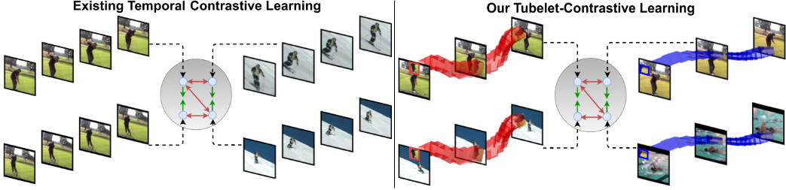

# Official PyTorch Implementation of Tubelet-Contrastive Learning (ICCV 2023).




> [**Tubelet-Contrastive Self-Supervision for Video-Efficient Generalization**](https://fmthoker.github.io/tubelet-contrastive-learning/)<br>
> [Fida Mohammad Thoker](https://fmthoker.github.io/), [Hazel Doughty](https://hazeldoughty.github.io/), [Cees Snoek](https://www.ceessnoek.info/),<br>University Of Amsterdam, VIS Lab

## 📰 News
**[2023.10.08]** The pre-trained models and scripts for **Mini-Kinetics** pretraning are available! <br>
**[2022.10.08]**  Code and pre-trained models are available now! <br>


## 🔨 Installation

Please follow the instructions in [INSTALL.md](INSTALL.md).

## ➡️ Data Preparation

Please follow the instructions in [DATASET.md](DATASET.md) for data preparation.

## 🔄 Pre-training

The pre-training instruction is in [PRETRAIN.md](PRETRAIN.md).

## ⤴️ Fine-tuning with pre-trained models

The fine-tuning instruction is in [FINETUNE.md](FINETUNE.md).

## 📍Model Zoo

We provide pre-trained and fine-tuned models in [MODEL_ZOO.md](MODEL_ZOO.md).


## ☎️ Contact 

Fida Mohammad Thoker: fmthoker@gmail.com

## 👍 Acknowledgements

This project is built upon [Catch the Patch](https://github.com/microsoft/CtP) and [mmcv](https://github.com/open-mmlab/mmcv). Thanks to the contributors of these great codebases.

## ✏️ Citation

If you think this project is helpful, please feel free to leave a star⭐️ and cite our paperrs below:

```
@inproceedings{thoker2023tubelet,
  author    = {Thoker, Fida Mohammad and Doughty, Hazel  and Snoek, Cees},
  title     = {Tubelet-Contrastive Self-Supervision for Video-Efficient Generalization},
  journal   = {ICCV},
  year      = {2023},
}
@inproceedings{thoker2022severe,
  author    = {Thoker, Fida Mohammad and Doughty, Hazel and Bagad, Piyush and Snoek, Cees},
  title     = {How Severe is Benchmark-Sensitivity in Video Self-Supervised Learning?},
  journal   = {ECCV},
  year      = {2022},
}
```
